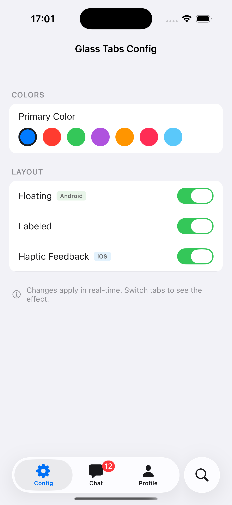
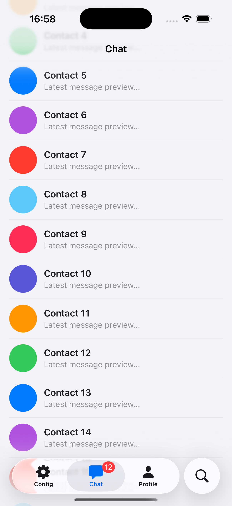
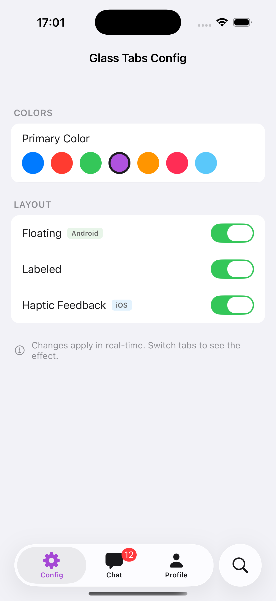
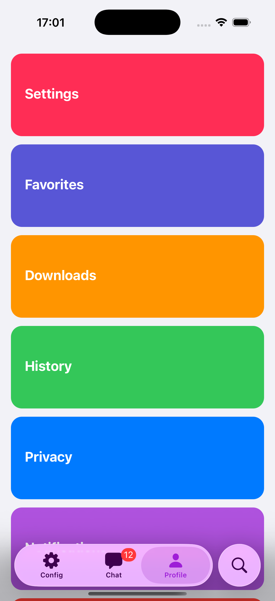
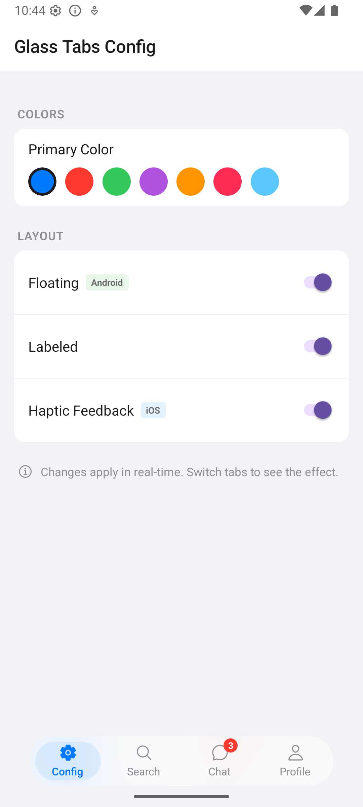
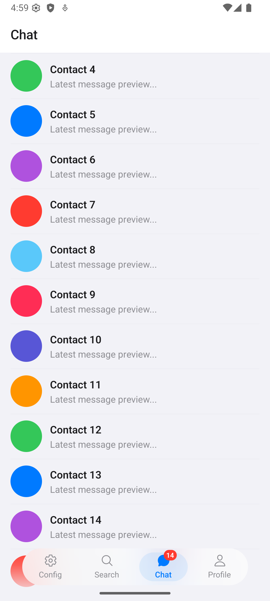
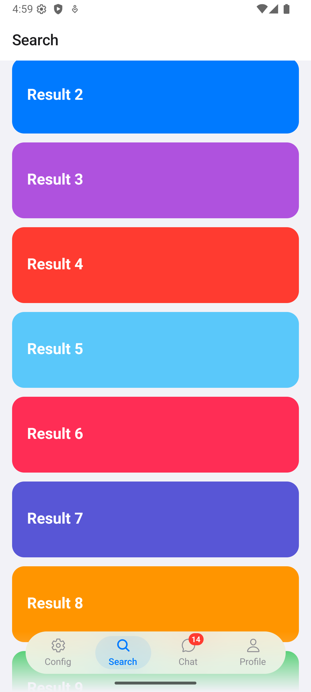
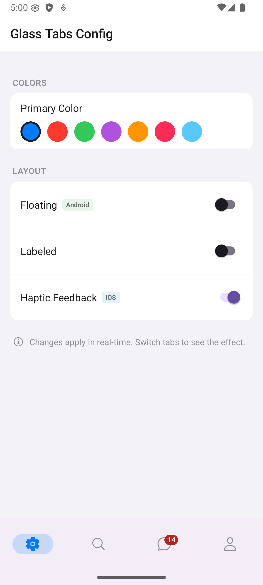
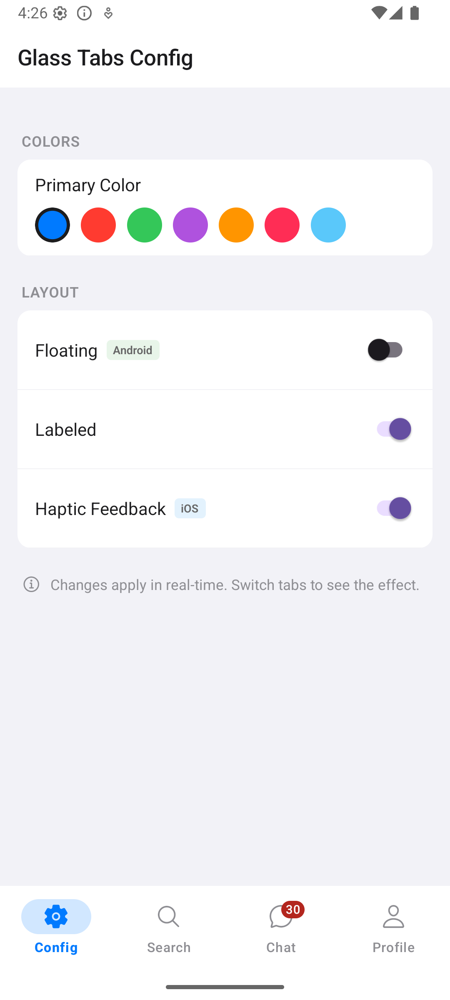
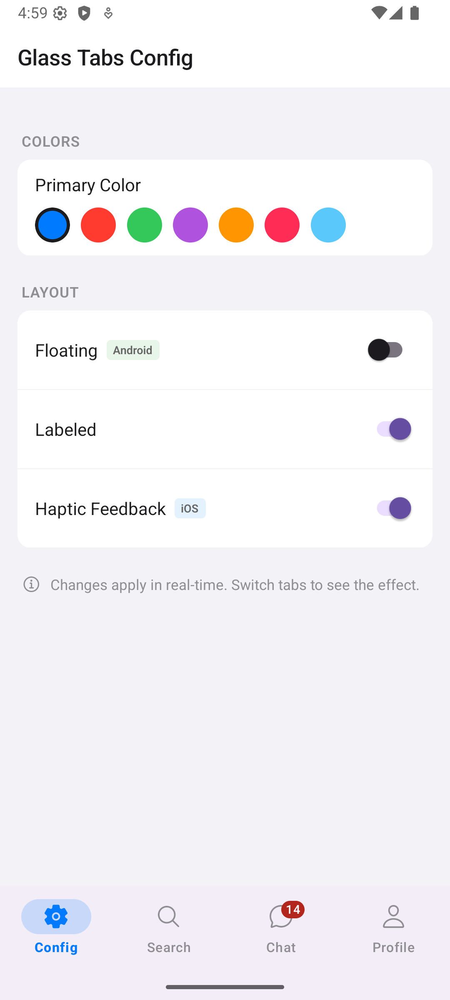

# react-native-glass-tabs

[](https://www.npmjs.com/package/react-native-glass-tabs)
[](https://github.com/louaySleman/react-native-glass-tabs/blob/main/LICENSE)
[](https://reactnative.dev/)
[](https://reactnative.dev/docs/the-new-architecture/landing-page)

**Links:** [GitHub](https://github.com/louaySleman/react-native-glass-tabs) · [npm](https://www.npmjs.com/package/react-native-glass-tabs) · [Issues](https://github.com/louaySleman/react-native-glass-tabs/issues) · [Example app](https://github.com/louaySleman/react-native-glass-tabs/tree/main/example)

> A drop-in adaptive bottom tab navigator with liquid glass on iOS 26+, GPU-blurred floating pill on Android, and graceful fallbacks — all from a single `<GlassTabs>` component.

## Screenshots

### iOS — Liquid Glass (iOS 26+)

<p float="left">
  
  
  
  
</p>

### Android — Floating Glass Pill & Material 3

<p float="left">
  
  
  
  
</p>

<p float="left">
  
  
</p>

## Features

- **iOS 26+**: Native liquid glass with SF Symbols and search role via SwiftUI TabView
- **iOS 18 and below**: Standard native UITabBarController
- **Android API 31+**: GPU-accelerated frosted glass floating pill (Telegram-style)
- **Android API < 31**: Semi-transparent floating pill with elevation shadow
- **Single API**: One component, adaptive rendering per platform/version
- **New Architecture ready**: Fabric & TurboModules supported
- **React Navigation 7+**: Drop-in compatible with `@react-navigation/bottom-tabs`

## Why react-native-glass-tabs?

| Feature | react-native-glass-tabs | @react-navigation/bottom-tabs | react-native-bottom-tabs |
|---------|:-----------------------:|:-----------------------------:|:------------------------:|
| Liquid glass (iOS 26) | Yes | No | Yes |
| GPU blur (Android) | Yes | No | No |
| Floating pill style | Yes | No | No |
| Single component API | Yes | No | No |
| Graceful fallbacks | Yes | N/A | Partial |
| Haptic feedback | Yes | Manual | No |
| Badge support | Yes | Yes | Yes |

## Installation

```bash
npm install react-native-glass-tabs
# or
yarn add react-native-glass-tabs
```

### Required peer dependencies

```bash
npm install @react-navigation/native @react-navigation/bottom-tabs react-native-screens react-native-safe-area-context
```

### Android Setup

Update `android/app/src/main/res/values/styles.xml`:

```xml
<style name="AppTheme" parent="Theme.Material3.DayNight.NoActionBar">
</style>
```

## Usage

### Shared icon (same on both platforms)

```tsx
import React from 'react';
import { NavigationContainer } from '@react-navigation/native';
import { GlassTabs } from 'react-native-glass-tabs';
import Icon from 'react-native-vector-icons/Ionicons';

const App = () => (
  <NavigationContainer>
    <GlassTabs
      tabs={[
        {
          name: 'Home',
          component: HomeScreen,
          title: 'Home',
          renderIcon: ({ color, size, focused }) => (
            <Icon name={focused ? 'home' : 'home-outline'} size={size} color={color} />
          ),
        },
        {
          name: 'Search',
          component: SearchScreen,
          title: 'Search',
          role: 'search',
          renderIcon: ({ color, size, focused }) => (
            <Icon name={focused ? 'search' : 'search-outline'} size={size} color={color} />
          ),
        },
      ]}
      primaryColor="#007AFF"
    />
  </NavigationContainer>
);
```

### Platform-specific icons

Use `PlatformIcons` to configure icons for each platform:

- **`sfSymbol`** — typed `SFSymbol` union for iOS 26+ liquid glass (rendered natively by SwiftUI). TypeScript autocomplete validates the value.
- **`nativeIcon`** — `{ filled, outline }` image sources for Android Material 3 bottom tabs (`floating={false}`). Accepts `require('./icon.png')`, `{ uri: '...' }`, or use `Ionicons.getImageSourceSync()` to generate from vector icon fonts at runtime.
- **`render`** — render function for JS-rendered tabs (floating glass pill on Android, iOS < 26 fallback). Receives `{ color, size, focused }`.

```tsx
import { Platform } from 'react-native';
import Ionicons from 'react-native-vector-icons/Ionicons';

// Helper to generate native icon images from Ionicons at runtime
const createNativeIcon = (filled: string, outline: string) => {
  if (Platform.OS !== 'android') return undefined;
  return {
    filled: Ionicons.getImageSourceSync(filled, 24, '#000000'),
    outline: Ionicons.getImageSourceSync(outline, 24, '#000000'),
  };
};

<GlassTabs
  tabs={[
    {
      name: 'Home',
      component: HomeScreen,
      title: 'Home',
      renderIcon: {
        sfSymbol: 'house.fill',
        nativeIcon: createNativeIcon('home', 'home-outline'),
        render: ({ color, size, focused }) => (
          <Ionicons name={focused ? 'home' : 'home-outline'} size={size} color={color} />
        ),
      },
    },
    {
      name: 'Profile',
      component: ProfileScreen,
      title: 'Profile',
      renderIcon: {
        sfSymbol: 'person.fill',
        nativeIcon: createNativeIcon('person', 'person-outline'),
        render: ({ color, size, focused }) => (
          <Ionicons name={focused ? 'person' : 'person-outline'} size={size} color={color} />
        ),
      },
    },
  ]}
  primaryColor="#007AFF"
  floating={false}
  labeled={true}
/>
```

> **Which fields are used when?**
> | Platform | `floating={true}` | `floating={false}` |
> |---|---|---|
> | **iOS 26+** | `sfSymbol` | `sfSymbol` |
> | **iOS < 26** | `render` | `render` |
> | **Android** | `render` | `nativeIcon` |

## Props

### `GlassTabsProps`

| Prop | Type | Default | Description |
|------|------|---------|-------------|
| `tabs` | `TabConfig[]` | **required** | Array of tab configurations (3-5 tabs) |
| `primaryColor` | `string` | `'#007AFF'` | Active tab tint color |
| `inactiveColor` | `string` | `'#8E8E93'` | Inactive tab tint color |
| `backgroundColor` | `string` | `'#FFFFFF'` | Bar background base color |
| `opacity` | `number` | `0.85` | Android glass opacity (0-1) |
| `cornerRadius` | `number` | `28` | Android pill corner radius (dp) |
| `floating` | `boolean` | `true` | `true`: floating glass pill with blur. `false`: native Material 3 `BottomNavigationView` |
| `floatingMargin` | `number` | `8` | Android floating margin (dp) |
| `hapticFeedback` | `boolean` | `true` | iOS haptic feedback on tap |
| `labeled` | `boolean` | `true` | Show text labels |
| `blurRadius` | `number` | `25` | Android blur radius (px, API 31+) |
| `initialRouteName` | `string` | first tab | Initial active tab |
| `translucent` | `boolean` | `true` | iOS liquid glass translucent |
| `colorScheme` | `'light' \| 'dark' \| 'auto'` | `'auto'` | Force light/dark mode or follow system |
| `scrollEdgeAppearance` | `'default' \| 'opaque' \| 'transparent'` | — | Tab bar scroll edge appearance (iOS native only) |
| `activeIndicatorColor` | `string` | — | Active tab indicator color (Android native & iOS native) |
| `rippleColor` | `string` | — | Touch ripple color (Android native only) |
| `disablePageAnimations` | `boolean` | — | Disable page transition animations (iOS native only) |
| `sidebarAdaptable` | `boolean` | — | Tab bar adaptable sidebar style (iPadOS, iOS native only) |
| `tabBarHidden` | `boolean` | — | Hide the tab bar completely |
| `minimizeBehavior` | `'automatic' \| 'onScrollDown' \| 'onScrollUp' \| 'never'` | — | Tab bar minimize behavior (iOS 26+ only) |
| `lazy` | `boolean` | `true` | Don't render screens until they are first focused |
| `tabBarStyle` | `ViewStyle` | — | Custom styles for the tab bar container (shadow, border, padding, etc.) |

### `TabConfig`

| Prop | Type | Description |
|------|------|-------------|
| `name` | `string` | Unique route key |
| `component` | `ComponentType` | Screen component |
| `title` | `string` | Tab label |
| `renderIcon` | `(props) => ReactNode \| PlatformIcons` | Simple render function or platform-specific object with `sfSymbol` (iOS 26+), `nativeIcon` (Android Material 3), and `render` (JS fallback) |
| `role` | `'search'?` | iOS liquid glass search tab role |
| `badge` | `number \| string?` | Badge value |
| `header` | `false \| HeaderConfig?` | Header configuration. `undefined` → default header, `false` → no header, `HeaderConfig` → custom header |
| `accessibilityLabel` | `string?` | Accessibility label for the tab button (screen readers) |
| `testID` | `string?` | Test ID for the tab button (e2e testing with Detox, Maestro, etc.) |
| `lazy` | `boolean?` | Per-tab override: don't render until first focused |
| `freezeOnBlur` | `boolean?` | Freeze the screen when it loses focus (improves performance) |
| `listeners` | `TabListeners?` | Navigation event listeners for this tab |

### `TabListeners`

| Prop | Type | Description |
|------|------|-------------|
| `tabPress` | `(e: { preventDefault }) => void` | Fired when the tab is pressed. Call `e.preventDefault()` to prevent navigation |
| `tabLongPress` | `() => void` | Fired when the tab is long-pressed |
| `focus` | `() => void` | Fired when the screen comes into focus |
| `blur` | `() => void` | Fired when the screen loses focus |

### `HeaderConfig`

| Prop | Type | Description |
|------|------|-------------|
| `title` | `string?` | Override header title (defaults to tab `title`) |
| `left` | `() => ReactNode?` | Component on the left side of the header |
| `right` | `() => ReactNode?` | Component on the right side of the header |
| `render` | `(props: { title }) => ReactNode?` | Fully replace the header with a custom component. Overrides all other header options |
| `style` | `ViewStyle?` | Custom header background style |
| `titleStyle` | `TextStyle?` | Custom header title text style |
| `titleAlign` | `'left' \| 'center'?` | Title alignment (default: `'left'` Android, `'center'` iOS) |
| `tintColor` | `string?` | Header icon/back button tint color |
| `transparent` | `boolean?` | Make header background transparent |
| `shadowVisible` | `boolean?` | Show/hide header bottom shadow |
| `largeTitle` | `boolean?` | Enable large title header (iOS only, collapses on scroll) |

### Header defaults

Headers are shown by default on all tabs. Each platform has sensible defaults out of the box:

| Default | iOS 26+ (Liquid Glass) | iOS < 26 | Android |
|---|---|---|---|
| **Transparent** | Yes (with blur) | No | No |
| **Blur effect** | Native (adapts to dark/light) | N/A | N/A |
| **Shadow** | Hidden | Visible | Visible |
| **Title align** | Center | Center | Left |
| **Title size** | 17px | 17px | 20px |
| **Dark mode** | Auto text/tint color | Auto text/tint color | Auto text/tint color |

On iOS 26+ with liquid glass, headers are **transparent with native blur by default** — content scrolls behind the header naturally. You don't need to set `transparent: true` in `HeaderConfig`. Use `transparent: true` only if you want transparent headers on non-liquid-glass platforms (iOS < 26, Android).

### Header examples

```tsx
// Default header (just tab title — transparent on liquid glass automatically)
{ name: 'Home', title: 'Home', component: HomeScreen, renderIcon: ... }

// No header
{ name: 'Profile', title: 'Profile', header: false, component: ProfileScreen, renderIcon: ... }

// Header with right button
{
  name: 'Home',
  title: 'Home',
  header: {
    right: () => (
      <TouchableOpacity onPress={() => alert('Settings')}>
        <Ionicons name="settings-outline" size={22} color="#007AFF" />
      </TouchableOpacity>
    ),
  },
  component: HomeScreen,
  renderIcon: ...,
}

// Custom styled header
{
  name: 'Chat',
  title: 'Messages',
  header: {
    title: 'My Chats',
    titleAlign: 'center',
    tintColor: '#FF0000',
    shadowVisible: false,
  },
  component: ChatScreen,
  renderIcon: ...,
}

// Large title header (iOS — collapses on scroll)
{
  name: 'Feed',
  title: 'Feed',
  header: { largeTitle: true },
  component: FeedScreen,
  renderIcon: ...,
}

// Fully custom header
{
  name: 'Inbox',
  title: 'Inbox',
  header: {
    render: ({ title }) => (
      <View style={{ paddingTop: 60, paddingHorizontal: 16, paddingBottom: 12, backgroundColor: '#fff' }}>
        <Text style={{ fontSize: 24, fontWeight: 'bold' }}>{title}</Text>
      </View>
    ),
  },
  component: InboxScreen,
  renderIcon: ...,
}
```

### Event listeners

Listen to tab navigation events per screen:

```tsx
<GlassTabs
  tabs={[
    {
      name: 'Home',
      component: HomeScreen,
      title: 'Home',
      renderIcon: ({ color, size, focused }) => (
        <Icon name={focused ? 'home' : 'home-outline'} size={size} color={color} />
      ),
      listeners: {
        tabPress: (e) => {
          // Prevent default navigation (e.g., show confirmation dialog)
          e.preventDefault();
        },
        tabLongPress: () => {
          // Show action sheet or context menu
        },
        focus: () => {
          // Track screen view analytics
        },
        blur: () => {
          // Pause video, cancel requests, etc.
        },
      },
    },
  ]}
/>
```

### Accessibility & testing

```tsx
{
  name: 'Profile',
  component: ProfileScreen,
  title: 'Profile',
  accessibilityLabel: 'Navigate to profile',
  testID: 'tab-profile',
  renderIcon: ...,
}
```

### Performance

```tsx
<GlassTabs
  lazy={true}                    // Don't mount screens until first focused (default)
  tabs={[
    {
      name: 'Heavy',
      component: HeavyScreen,
      title: 'Heavy',
      freezeOnBlur: true,        // Freeze this screen when not visible
      renderIcon: ...,
    },
  ]}
/>
```

## How it works

### iOS 26+ (Liquid Glass)
Uses `@bottom-tabs/react-navigation` which wraps SwiftUI's `TabView` with native liquid glass effects. SF Symbols are rendered natively. Each tab is wrapped in a `@react-navigation/native-stack` with transparent headers and native blur. The `search` role activates the native iOS search tab appearance.

### iOS 18 and below
Uses `@react-navigation/bottom-tabs` with standard `UITabBarController` styling. Your `render` function is used for all icons. Headers use the built-in bottom-tabs header system. Dark mode adapts tab bar background, borders, and header text colors automatically.

### Android — Floating (`floating={true}`, default)
A custom native Kotlin module applies `RenderEffect.createBlurEffect()` to the tab bar background (API 31+), creating a GPU-accelerated frosted glass effect behind a floating pill-shaped bar. Falls back to semi-transparent solid background with elevation shadow on API < 31. Each tab is wrapped in a `@react-navigation/native-stack` for consistent headers across all modes.

### Android — Standard (`floating={false}`)
Uses `@bottom-tabs/react-navigation` which wraps the native Material 3 `BottomNavigationView`. Icons are provided via `nativeIcon` with `filled` and `outline` image sources. Each tab is wrapped in a `@react-navigation/native-stack` for headers identical to floating mode. Falls back to `@react-navigation/bottom-tabs` if `@bottom-tabs/react-navigation` is not installed.

## FAQ

### How do I add liquid glass tabs to my React Native app?

Install `react-native-glass-tabs` and wrap your screens in a single `<GlassTabs>` component. It automatically uses native liquid glass on iOS 26+, a GPU-blurred floating pill on Android, and standard tabs on older iOS — no platform checks needed.

### What's the difference between this and `@react-navigation/bottom-tabs`?

`@react-navigation/bottom-tabs` provides standard tab navigation without glass effects, blur, or floating pill styles. `react-native-glass-tabs` builds on top of it and adds liquid glass (iOS 26+), GPU-accelerated frosted glass blur (Android), a Telegram-style floating pill tab bar, SF Symbol support, and automatic platform adaptation — all through a single unified API.

### Does this work with Expo?

Yes. The JavaScript-based navigators work out of the box with Expo. For the native Android blur effect (`GlassBarNativeView`), you need a development build (`expo prebuild`). The package gracefully falls back when native modules aren't available.

### Does this support React Navigation 7?

Yes. `react-native-glass-tabs` requires `@react-navigation/bottom-tabs >= 7.0.0` and `@react-navigation/native >= 7.0.0`. It's fully compatible with React Navigation 7's API.

### Does this support the New Architecture (Fabric / TurboModules)?

Yes. The package includes `codegenConfig` and is compatible with both the old and new React Native architectures.

## License

[MIT](https://github.com/louaySleman/react-native-glass-tabs/blob/main/LICENSE)
